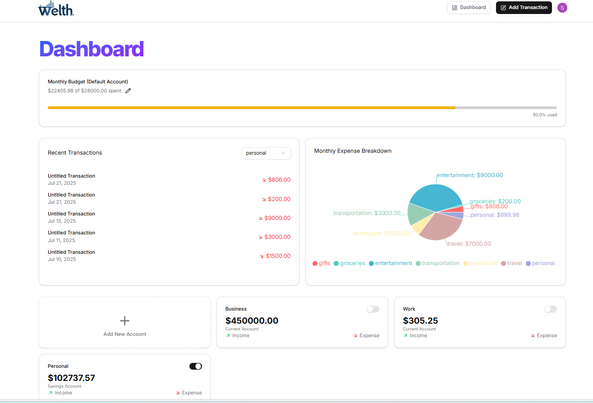
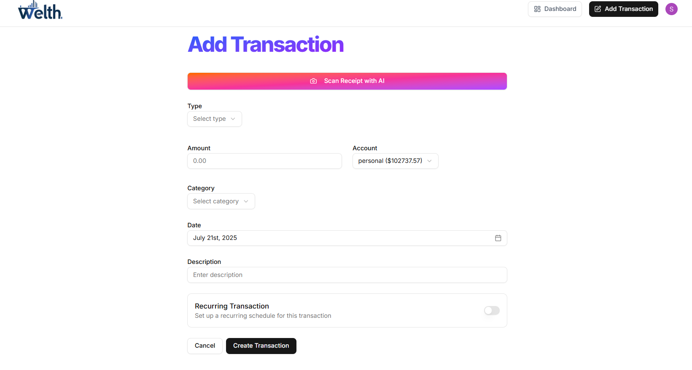
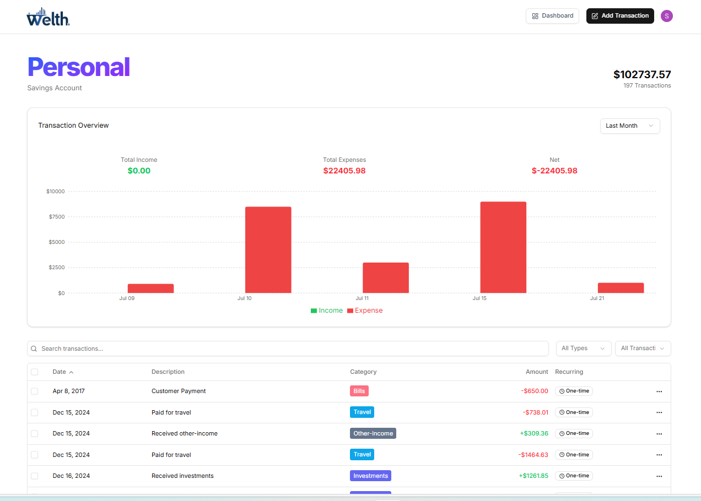

# 📊 AI Finance Platform
A smart, AI-powered finance management application that helps users track transactions, analyze spending habits, and get personalized financial insights.  


## 🚀 Features
- Create and manage accounts
- Add transactions easily
- Scan receipts to add expenses
- See spending insights and advice
- Secure login with authentication
### 📈 **Spending Insights**
- Visual breakdown of your expenses by category.
- Date-range filtering with instant updates.
  


---
### 📷 **Receipt Scanning**
- Upload receipts and let AI extract transaction details automatically.
- Supports multiple formats: JPG, PNG, PDF.



### 💳 **Transaction Management**
- Add, edit, and delete transactions easily.
- Categorize expenses & incomes for better tracking.
  


## 🛠️ **Tech Stack**
- **Frontend:** React, Tailwind CSS, ShadCN UI
- **Backend:** Supabase
- **Authentication:** Clerk
- **AI Processing:** Google Gemini API (for receipt parsing )

---

## 📦 Installation

```bash
# Clone the repository
git clone https://github.com/your-username/your-repo-name.git

# Navigate into the project folder
cd your-repo-name

# Install dependencies
npm install

# Start the development server
npm run dev
